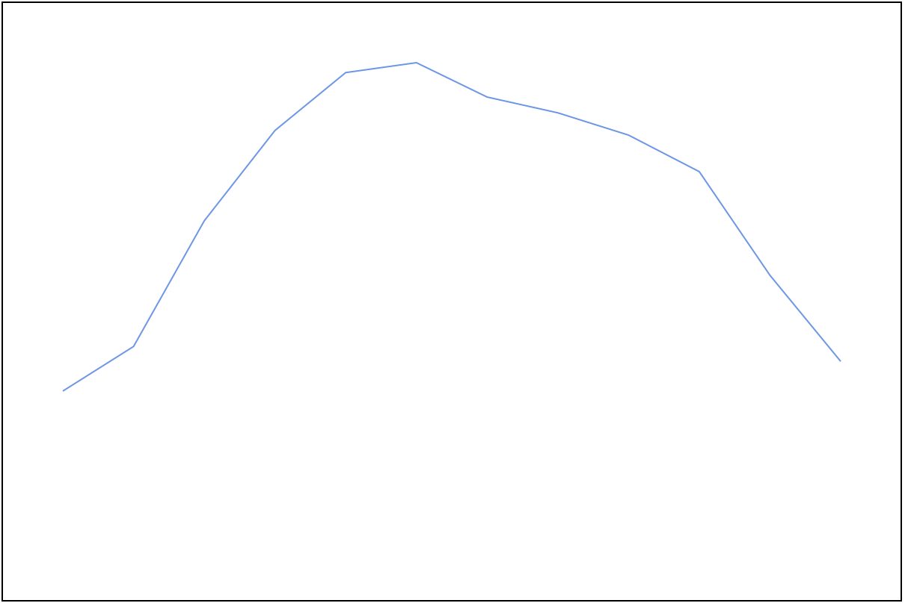
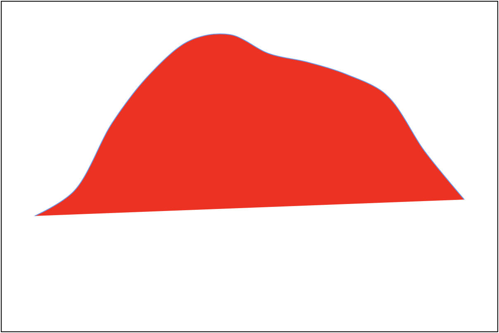
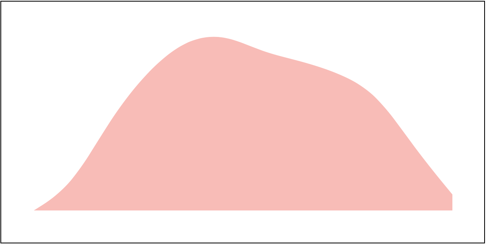
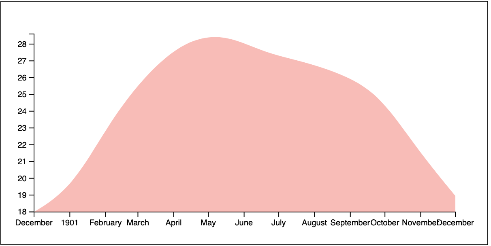
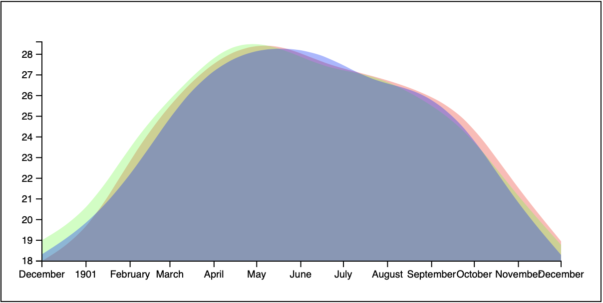

# Areas

In this section, we will make a new graph and follow all of the steps we used in the previous graph for review and make a few changes along the way. 

This time you will be making an area chart. Better read up on those to understand when they would be best used: https://www.data-to-viz.com/graph/area.html

## The Data

The dataset for this example will be the `Weather Data in India from 1901 to 2017.csv`. This dataset contains the mean temperature for each month of the years for the years 1901 to 2017. 

The data came from Kaggle here: https://www.kaggle.com/mahendran1/weather-data-in-india-from-1901-to-2017

Here is a look at the data: 

```CSV
,YEAR,JAN,FEB,MAR,APR,MAY,JUN,JUL,AUG,SEP,OCT,NOV,DEC
0,1901,17.99,19.43,23.49,26.41,28.28,28.6,27.49,26.98,26.26,25.08,21.73,18.95
1,1902,19.0,20.39,24.1,26.54,28.68,28.44,27.29,27.05,25.95,24.37,21.33,18.78
2,1903,18.32,19.79,22.46,26.03,27.93,28.41,28.04,26.63,26.34,24.57,20.96,18.29
...
```

It's the year and each month. The first column is unlabeled and appears to have a row number. 

There are a few ways we can look at this data. 

1. All months and all years. This would be a lot of information but might show a trend over time. Imaging a long timline stepping through each month over many years. 
2. All months for a single year. This would be twelve numbers. It might show the change in temperature over a year. 
3. One month for all years. For example Jan 1901, Jan 1902, Jan 1903, etc. This could show a trends for a time of year allowing you to compare the temperature in same month over many years. 

Sometimes you will need to look at the data and arrange or rearrange the data to suit your pupose. The data will not always be in the form that you need. D3 can do some of this but other times you need to use your JS skills to arrange the data to suit your purpose. 

## Getting started

**Challenge:** Setup the boiler plate document on your own! 

- Setup an HTML document
- copy the `Weather Data in India from 1901 to 2017.csv`
- Add an SVG element
- Import the D3 library
- Add a script tag for your scripts
- load the weather data csv file

Do this from memory if you can. Refer to the other tutorial projects if you get stuck. 

Add the following script. Here you take the idea from the last examples but this time use `async` and `await`. 

```JS
async function handleData() {
  const data = await d3.csv('Weather Data in India from 1901 to 2017.csv')
  console.log(data)
  // draw things here later...
}

handleData()
```

Note! `handleData()` in this example is `async`. That means you can `await` any promise to resolve inside this function. `d3.csv()` returns a promise. So you use `await` on line 2, which will wait on that line until the promise resolves before continuing to the next line. 

Using the console to see the data you get: 

```JS
[
  {: "0", YEAR: "1901", JAN: "17.99", FEB: "19.43", MAR: "23.49", ...}
  {: "1", YEAR: "1902", JAN: "19.0", FEB: "20.39", MAR: "24.1", ...}
  {: "2", YEAR: "1903", JAN: "18.32", FEB: "19.79", MAR: "22.46", ...}
  ...
]
```

Each element of the array is an object. To show all months for a single year you'll have to turn that year object into an array of months.  

You should have a helper function to do that. 

**Challenge**

Write a function that takes an object with the `MON:TEMP` and turn it into an array of objects with properties `month` and `temp`. While you're at it convert those temperature strings to numbers. For example: 

```JS
// Turn this:
const obj = {: "0", YEAR: "1901", JAN: "17.99", FEB: "19.43", MAR: "23.49", ...}
function convertToArray(obj) {
  // Challenge...
}

const arr = convertToArray(obj)
// Into: 
// [{ month:'JAN', temp: 17.99 }, { month: 'FEB', temp: 19.43 }, { month: 'MAR', temp: 23.49 }, ...]
```

Compare the input and the ouput above. You are starting with `{ ... }` and ending with `[{}, {}, ...]`

<details>
  <summary>
    ** Solution **
  </summary>
 
```js
function convertToArray(obj) {
  const months = ['JAN', 'FEB', 'MAR', 'APR', 'MAY', 'JUN', 'JUL', 'AUG', 'SEP', 'OCT', 'NOV', 'DEC']
  return months.map(month => {
  const temp = parseFloat(obj[month])
    return { month: month, temp }
  }) 
}
```

</details>

When you're done with this use your code to get one of the months of temperature data. The goal is to show one month of temperature data for a single year. 

```JS
async function handleData() {
  const data = await d3.csv('Weather Data in India from 1901 to 2017.csv')
  const year_1901 = data[0] // Get the first year data object
  const months_1901 = convertToArray(year_1901) // convert to array
  console.log(months_1901) // check your work

  // Drawing code here...
}
```

Look in the browser console to check your work. 

## Drawing a path

Let's review drawing a path. Start by defining the size of the document. 

Add a few variables to define the size of the SVG viewport and the margins for the axis. 

```JS
const width = 600
const height = 300
const margin = 40
```

You need a scale for the x and y-axis. The x-axis is time but we don't have a full date, just the month, so we can use the index here. 

Define the xscale:

```JS
const xscale = d3.scaleLinear()
  .domain([0, months_1901.length - 1])
  .range([margin, width - margin])
```

The y scale will be based on the temp data. 

Now define the y scale: 

```JS
const yscale = d3.scaleLinear()
  .domain(d3.extent(months_1901, d => d.temp))
  .range([height - margin, margin])
```

This time you'll plan ahead and make a group for the path. 

Add the following to set up the SVG elements with D3. 

```JS
// Select the SVG
const svg = d3
  .select('#svg')

// Make a group for the graph
const graph = svg
  .append('g')
```

Define a line generator. 

```JS
// line generator
const linegen = d3.line()
  .x((d, i) => xscale(i))
  .y(d => yscale(d.temp))
  .curve(d3.curveLinear)
```

Notice you used the index of the data for the x-axis to space things evenly left to right. You used the temp value for the y scale. This sets the height based on the data. 

Now draw the line. You'll draw simple linear/straight lines for now. Later you can smooth it with one of the line interpolators. 

Add the following to draw a line in the "graph" group. 

```JS
// Draw the graph
graph
  .append('path')
  .attr('d', linegen(months_1901))
  .attr('stroke-width', 1)
  .attr('stroke', 'cornflowerblue')
  .attr('fill', 'none')
```

At this point you should have something like this: 



### Curved path

This looks good but what if you wanted a smooth curved path. Currently, D3 is drawing straight line segments from point to point. 

In the last example, we created a graph with straight lines. This used the SVG path. If you recall I showed this example: 

```SVG
<path d="M 10,30
  A 20,20 0,0,1 50,30
  A 20,20 0,0,1 90,30
  Q 90,60 50,90
  Q 10,60 10,30 z"/>
```


Check the course code for this image it's the code from above wrapped in an SVG document! 

The code above is hard for us to write. It is not human-readable. Luckily D3 has a function to help us out. 

Take a look at the `linegen` function: 

```JS
// line generator
const linegen = d3.line()
  .x((d, i) => xscale(i))
  .y(d => yscale(d.temp))
  .curve(d3.curveLinear) // defines the curve type!
```

It's the last line here that defines the curvetype used. D3 has several built in curve types:

- `curveLinear`
- `curveStep`
- `curveStepBefore`
- `curveStepAfter`
- `curveBasis`
- `curveCardinal`
- `curveMonotoneX`
- `curveCatmullRom`

It's hard to put these into words try them out for yourself. Some of these will have subtle differences and this graph may not make those differences obvious. Others have very noticable differences. 

Try these:

```JS
...
.curve(d3.curveStep)
```

```JS
...
.curve(d3.curveBasis)
```

The difference between these two and linear is noticeable. 

### Adding a fill 

What if we wanted to add a fill? 

You could add a fill to the `path` element. Try it: 

Add the following attribute to your path:

```JS
...
.attr('fill', 'red')
```

This might look like: 



This doesn't look so great because the doesn't end and start at a consistent point. 

Luckily D3 has us covered. If we are drawing a path and want to make a fill we can use `d3.area()` instead of `d3.line()`. 

Try it out. Change the `linegen` function to look like: 

```JS
const linegen = d3.area() // change line to area
  .x((d, i) => xscale(i))
  .y0(d => yscale(d.temp)) // change y to y0
  .y1(height - margin) // add this line
  .curve(d3.curveBasis)
```

Here you are swapping `d3.line()` for `d3.area()`. This is going to draw a filled shape. Rather than ending the line at the endpoints. The `area()` function will close the shape by drawing a line from the last point down to a baseline then across to the starting x and up to the first point. 

The `y0()` method maps each point along the top of the chart. You used the temp values run through the `yscale()` function. 

The `y1()` function maps the outline of the area/shape that runs from the last point down to the bottom of the shape and along the bottom edge back to the first point. 

Here you used the height less the margin to run the bottom of the area/shape about 40px up from the bottom of the viewport.

**Challenge**

Adjust the fill. Try a transparent color. 

Might be good to remove the stroke. 

Might look like this at this stage: 



## Add an axis!

**Challenge**

This is a review! Give it a try on your own. Here are a few tips. 

It will be awkward to get the dates from this data since we have an object that represents the year, and then an array of months that are just given as an abreviation. Just hack this together by making an extent of 12 months. Something like this: 

```JS
const monthsScale = d3.scaleTime()
  .domain([new Date('1901-01-01'), new Date('1901-12-01')])
  .range([margin, width - margin])
  .nice()
```

Rather than trying to get the dates from your data, you can just declare the extent with two date objects. 

```JS
[ new Date('1901-01-01'), new Date('1901-12-01') ]
```

The first date is: `Jan 1, 1901` the last date is: `Dec 1, 1901`. 

Set the range to: 

```JS
[ margin, width - margin ]
```

The left edge should be margin (40px) from the left and the right should be 40px from the right (width - 40px). 

<details>
  <summary>
  ** Solution **
  </summary>
 
```js
// Define the axis generators
const bottomAxis = d3.axisBottom(monthsScale)
const leftAxis = d3.axisLeft(yscale)
// Create the bottom axis
svg
  .append('g')
  .attr('transform', `translate(0, ${height - margin})`)
  .call(bottomAxis)
// Create the left axis
svg
  .append('g')
  .attr('transform', `translate(${margin}, 0)`)
  .call(leftAxis)
```

</details>

Might look like this when you're done. 



**Challenge** 

Draw another area using another year of data. For example draw the temperature for all 12 months of both 1901 and 1902. 

Superimpose these one on top of the other. Give them a transparent fill. 

Give yourself bonus points for using a function!

Might look like this when you're done: 



**Challenge**
Draw each new area with a different fill color. Use opacity to make these transparent. 

Bonus points for using a scale to determine the color! Use the ideas from the previous tutorial on color scales. 

**Stretch Challenge**
If you solved the challenge above you may notice that some of the data falls off the bottom of the chart, that is it dips below the bottom of the scale, or possibly above the top of the scale. 

This happens because the yscale used gets it's extents from the 1901 data. Which has a minimum of temp of 18. The data covers years from 1901 to 2017 and it's possible that one of those years has a monimum temp less than 18! For example 1948 shows 17.33. 

The same applies to the maximum temp. This challnge to is to set the extents of the yscale to min and max temp found in all of the data! 

**Stretch Challenge**

This graph shows the mean temperature each month of a year. It might be good if you could show the temperature for the same month of all years represented in the data. 

## Conclusion 

In this tutorial you learned to create an area chart. You used D3's area generator along with all of the other things that were covered in the previous tutorials! 

This is an area chart, read more about these here: https://www.data-to-viz.com/graph/area.html
