# Sankey Diagrams

A sankey diagram show amounts through stages. This represents the flow and changes and division in values. 

Read about sankey here: https://en.wikipedia.org/wiki/Sankey_diagram

Take a look at some sankey charts on Observable: https://observablehq.com/search?query=sankey

## Make a Sankey Diagram
This example will create a sankey chart using vanilla html and D3. We won't be using React for this. You could take the ideas here and combine them with the previous tutorial to create a React version of this project! 

Start with an HTML file:

```HTML
<!DOCTYPE html>
<html lang="en">
<head>
  <meta charset="UTF-8">
  <meta name="viewport" content="width=device-width,initial-scale=1.0">
  <title>sankey chart</title>
</head>
<body>

</body>
</html>
```

Add an SVG element. 

```HTML
<svg id="svg" width="600" height="600"></svg>
```

D3 doesn't support sankey charts out of the box, you must import some extra code from this repo: https://github.com/d3/d3-sankey

Check out the "installation" section: https://github.com/d3/d3-sankey?tab=readme-ov-file#installing and get the script tags that import sankey from the CDN. 

```HTML
<script src="https://unpkg.com/d3-array@1"></script>
<script src="https://unpkg.com/d3-collection@1"></script>
<script src="https://unpkg.com/d3-path@1"></script>
<script src="https://unpkg.com/d3-shape@1"></script>
<script src="https://unpkg.com/d3-sankey@0"></script>
```

You'll also need D3. get that from the D3 site: https://d3js.org/getting-started

```HTML
<script src="https://cdn.jsdelivr.net/npm/d3@7"></script>
```

Now add a script tag where you will do your work!

```HTML
<script>
  // Your code here!
</script>
```

## Data
The data used for a sankey chart must be arranged as an object with `nodes` and `links`. Nodes determines the "bars" and links draw the paths between the nodes. Every link connects two nodes!

A simple sankey with two nodes and a single link:

```js
const graph = {
  nodes: [
    { node: 0, name: 'node0' },
    { node: 1, name: 'node1' },
  ],
  links: [
    { source: 0, target: 1, value: 3, name: 'node 0 to 1' },
  ]
}
```

Might create a chart that looks like this: 

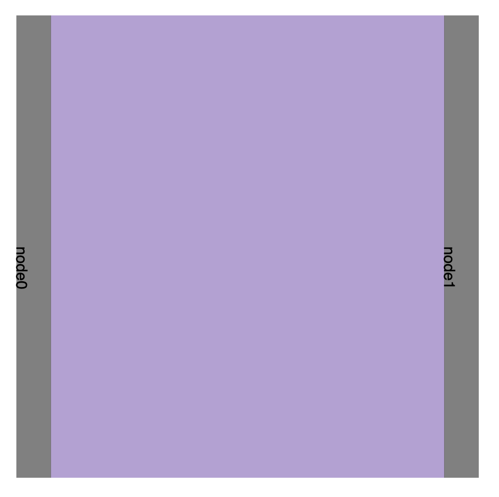

Notice that there are two nodes: `node0` and `node1`. There is a single "link" that connects them. 

The two nodes are defined in `nodes`, and `links` defines a single link with a `source` and `target`. The `source` determines where the link begins and `target` determines where the link ends. 

You could add another link:

```JS
const graph = {
  nodes: [
    { node: 0, name: 'node0' },
    { node: 1, name: 'node1' },
  ],
  links: [
    { source: 0, target: 1, value: 3, name: 'node 0 to 1' },
    { source: 0, target: 1, value: 1, name: 'node 0 to 1' }
  ]
}
```

This might look like this: 

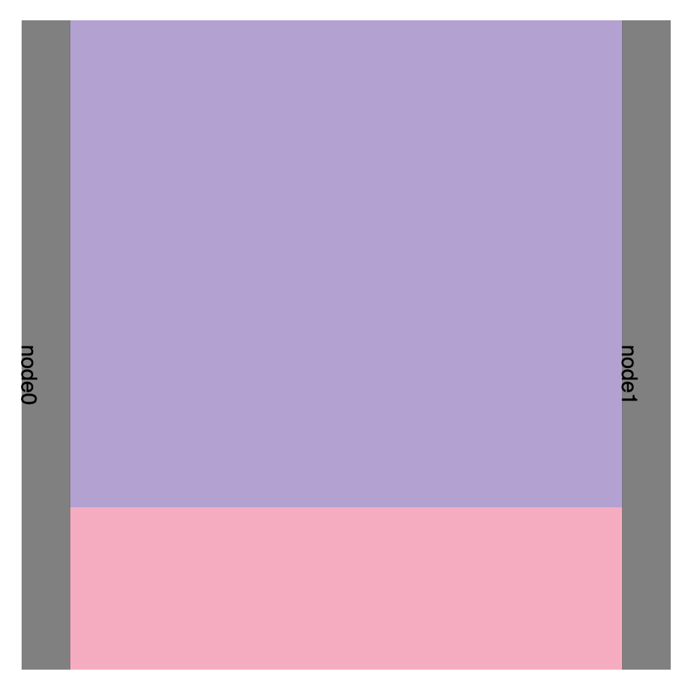

Here I added a new link. This link has the same `source` and `target`. 

Note! The values. The values detemine the size of the link. In the example the first link has a value of 3 and the second has a value 1, so the first is 3 times larger. 

Lets add another node. When we do this we need to make sure that all of the links connect to nodes. 

```js
const graph = {
  nodes: [
    { node: 0, name: 'node0' },
    { node: 1, name: 'node1' },
    { node: 2, name: 'node2' },
  ],
  links: [
    { source: 0, target: 1, value: 3, name: 'node 0 to 1' },
    { source: 0, target: 2, value: 1, name: 'node 0 to 2' }
  ]
}
```

Here there are three nodes and two links. Both links share the same source node. The first link ends at node 1 and the second link ends at node 2. 

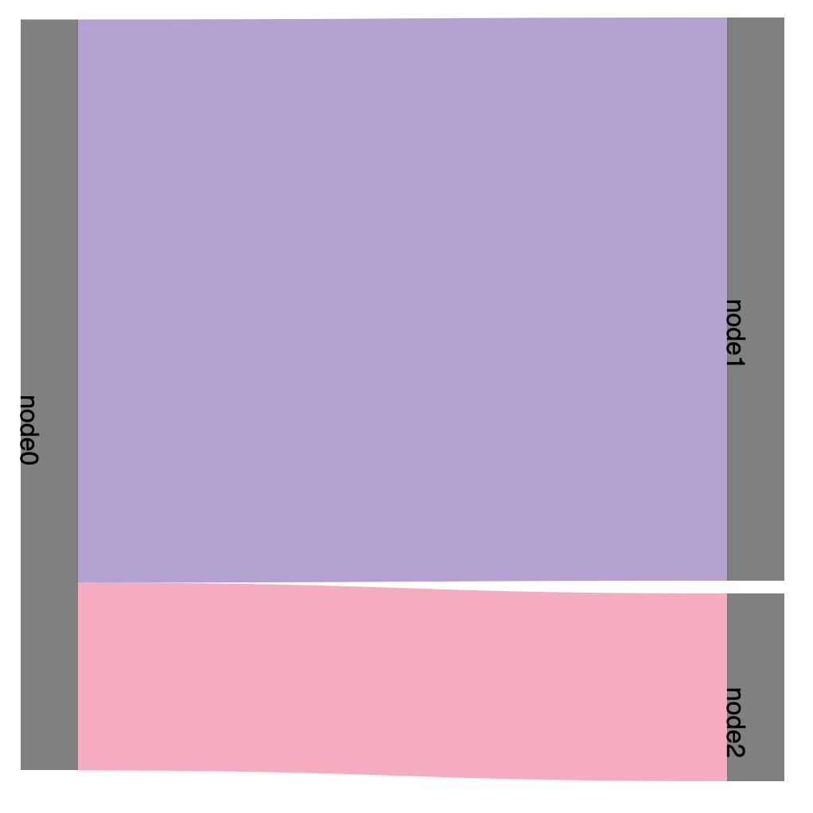

Imagine that this chart might show a total that splits into to two categories. For example, `node0` might represent total passengers on the Titanic, and `node1` could passengers that died, and `node2` could be passengers that survived. 

If we add a couple more nodes we might get this. You could imagine that we are showing deceased by gender. 

```JS
const graph = {
  nodes: [
    { node: 0, name: 'node0' },
    { node: 1, name: 'node1' },
    { node: 2, name: 'node2' },
    { node: 3, name: 'node3' },
    { node: 4, name: 'node4' },
  ],
  links: [
    { source: 0, target: 1, value: 3, name: 'node 0 to 1' },
    { source: 0, target: 2, value: 1, name: 'node 0 to 2' },
    { source: 1, target: 3, value: 2, name: 'node 1 to 3' },
    { source: 1, target: 4, value: 1, name: 'node 1 to 4' }
  ]
}
```

`node3` migth be male and `node4` might be female. It might look like this. 

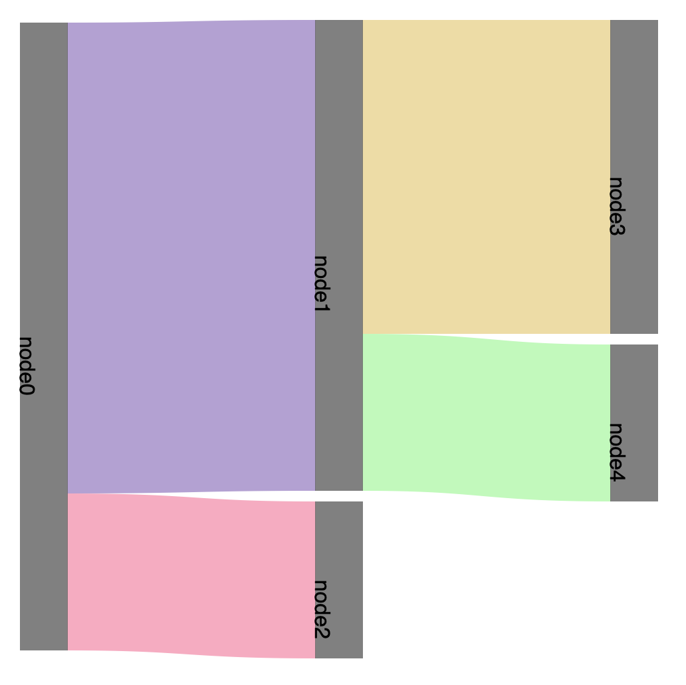

Note! The `value` of links 3 and 4 add up to 3. The total passengers might be 4, since links 1 and 2 have a total value of 4. There is still one unit of passengers left unaccounted. 

Imagine all of sirviors were female. We could add one more link from survivors to female passengers. Ths time I changed the names to match the categories. 

```JS
 const graph = {
  nodes: [
    { node: 0, name: 'Passengers' },
    { node: 1, name: 'Deceased' },
    { node: 2, name: 'Survived' },
    { node: 3, name: 'Male' },
    { node: 4, name: 'Female' },
  ],
  links: [
    { source: 0, target: 1, value: 549, name: 'node 0 to 1' },
    { source: 0, target: 2, value: 342, name: 'node 0 to 2' },
    { source: 1, target: 3, value: 2, name: 'node 1 to 3' },
    { source: 1, target: 4, value: 1, name: 'node 1 to 4' },
    { source: 2, target: 4, value: 1, name: 'node 2 to 4' }
  ]
}
```

It might look like this. 

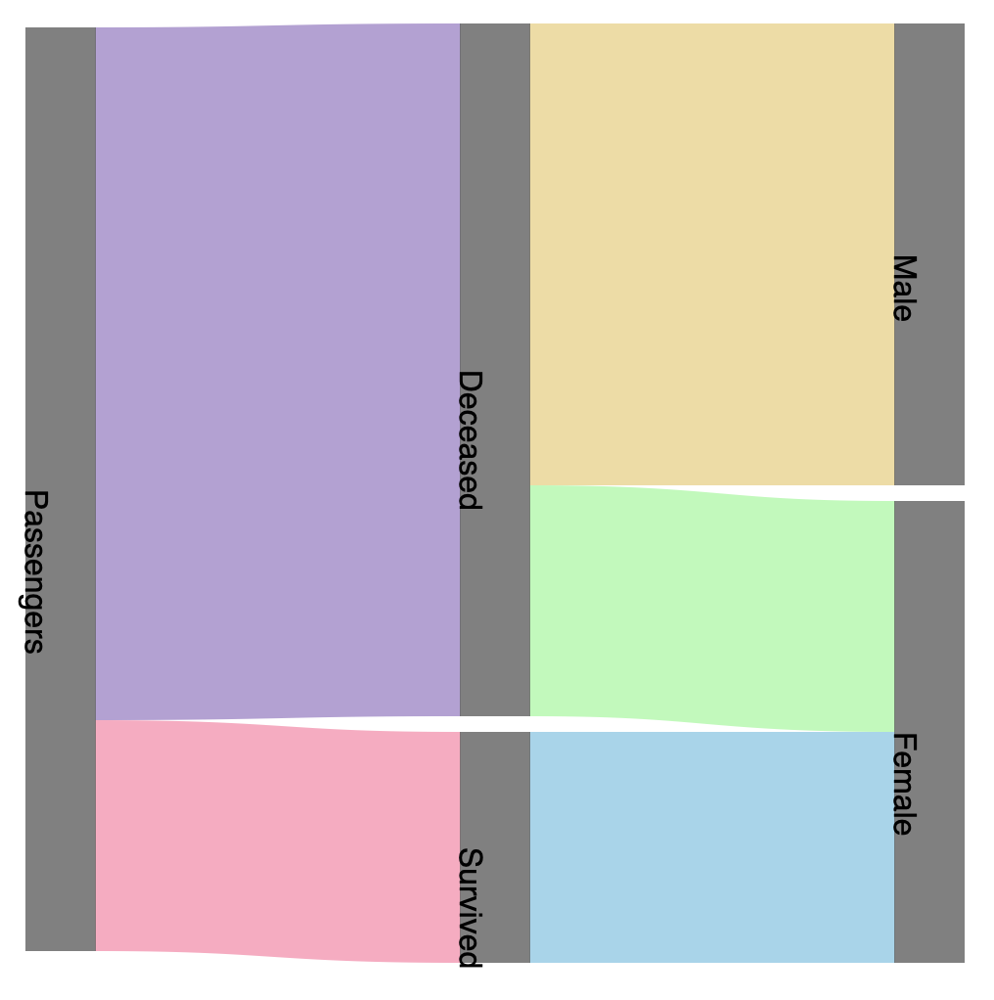

This is not accurate to the Titanic data since this exmaple shows only 4 passengers total, two men and two women, one woman survivor, two men and one woman died. 

Lets plug in some numbers from the Titanic dataset. This time we have some male survivors so I added another link. 

```JS
const graph = {
  nodes: [
    { node: 0, name: 'Passengers' },
    { node: 1, name: 'Deceased' },
    { node: 2, name: 'Survived' },
    { node: 3, name: 'Male' },
    { node: 4, name: 'Female' },
  ],
  links: [
    { source: 0, target: 1, value: 549, name: 'Male' },
    { source: 0, target: 2, value: 342, name: 'Female' },
    { source: 1, target: 3, value: 468, name: 'Deceased Male' },
    { source: 1, target: 4, value: 81, name: 'Deceased Female' },
    { source: 2, target: 3, value: 109, name: 'Survived Male' },
    { source: 2, target: 4, value: 233, name: 'Survived Female' }
  ]
}
```

This might look like this. 

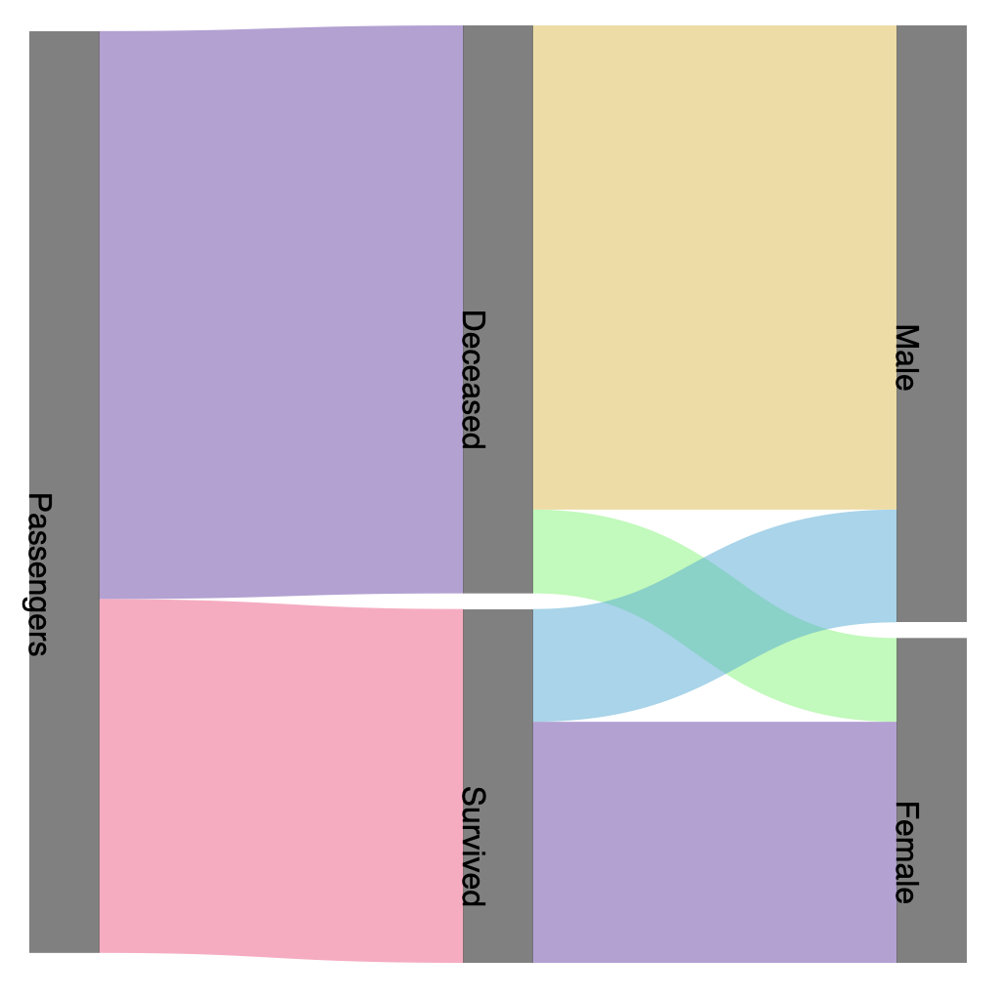

That should give you an idea of how the data should be arranged to create this type of chart. Obviously, you will need to create the data structure yourself from whatever source data you start with! 

## D3 sankey
To get started add some code to your html document. To start you will use the data from above. Define your "graph" like this: 

```JS
<script>
const graph = {
  nodes: [
    { node: 0, name: 'Passengers' },
    { node: 1, name: 'Deceased' },
    { node: 2, name: 'Survived' },
    { node: 3, name: 'Male' },
    { node: 4, name: 'Female' },
  ],
  links: [
    { source: 0, target: 1, value: 549, name: 'Male' },
    { source: 0, target: 2, value: 342, name: 'Female' },
    { source: 1, target: 3, value: 468, name: 'Deceased Male' },
    { source: 1, target: 4, value: 81, name: 'Deceased Female' },
    { source: 2, target: 3, value: 109, name: 'Survived Male' },
    { source: 2, target: 4, value: 233, name: 'Survived Female' }
  ]
}


</script>
```

Start by selecting the svg element. 

```JS
const svg = d3.select("#svg")
```

Lets add a color scale. For this example I'm using `d3.scaleSequential()` which returns a different color for each index. 

```JS
const colorScale = d3.scaleSequential()
  .domain([0, 5])
  .interpolator(d3.interpolateRainbow);
```

Next create a "sankey generator". 

```JS
// sankey generator
const sankeyGen = d3.sankey()
  .nodeWidth(36)
  .nodePadding(10)
  .extent([[10, 10], [490, 490]])
```

Here you defined a generator function. You also set some options. Lets look at the options. 

```JS
.nodeWidth(36)
```

Sets the width of the nodes. Nodes are the rectangles that connect the links. This sets the width of the nodes to 36 pixles. 

```JS
.nodeWidth(100)
```

Might look like this. 

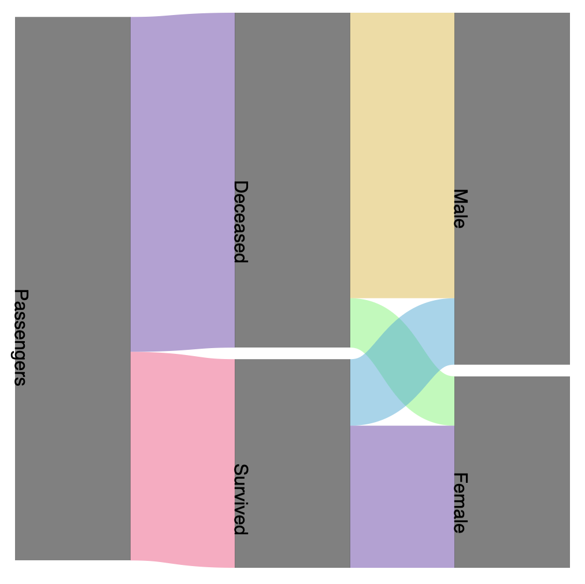

```js
.nodePadding(10)
```

This sets the space between nodes and links. The space in the example was 10 pixels.

```js
.nodePadding(100)
```

Might look like this. 

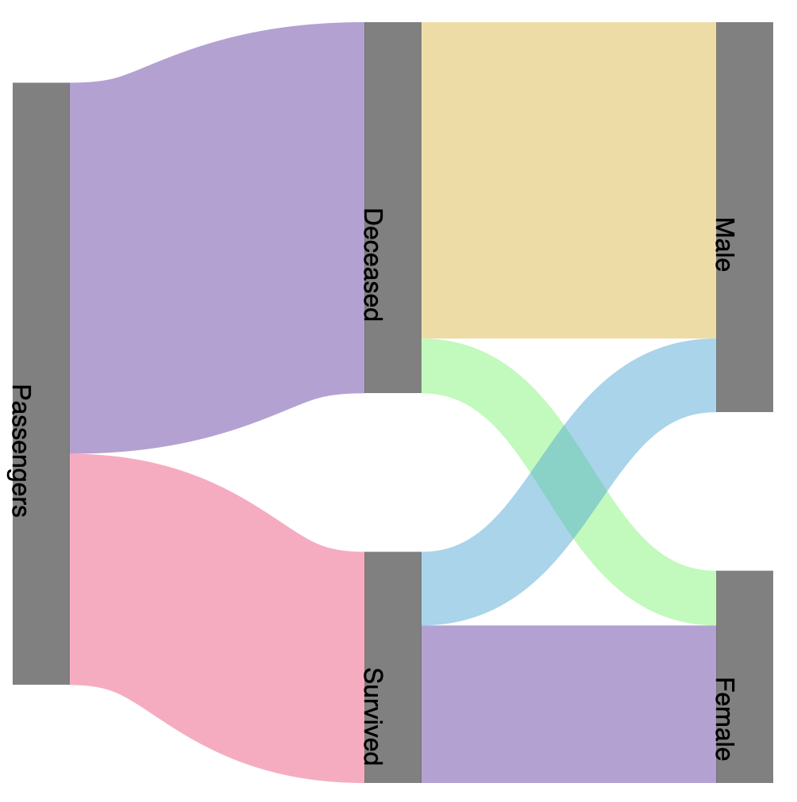

```JS
.extent([[10, 10], [490, 490]])
```

Extent defines the upper left and lower right corners of the chart. In this example we set the upper left corner to x of 10 and y of 10. This places the upper left corner 10 pixels in from the upper left of the svg. The lower right corner was placed at x 490 and y 490. These values fit the chart 10 pixels in from the edges of the svg element, which has a width and height of 500. 

Next, pass the graph data into the genertor function and get the nodes and links it returns. 

```js
const { nodes, links } = sankeyGen(graph)
```

`nodes` and `links` are arrays that include the original data plus data that can be used to draw the elements the nodes and links represent with D3. 

Now we need a link generator. This will draw the link paths. 

```JS
const linkGen = d3.sankeyLinkHorizontal()
```

This link generator will generate horizontal links. 

You will arrange the svg elements in groups to keep things organized. There will be a group for the links, a group for the nodes, and a group for the labels. 

Add a group for the links, and save that selection to a variable. 

```js
const linkGroup = svg
  .append('g')
```

Now draw the links. Links are drawn as a single line that has a really wide stroke. 

```JS
linkGroup
  .selectAll('path')
  .data(links)
  .enter()
  .append('path')
  .attr('class', 'link')
  .attr('d', d3.sankeyLinkHorizontal())
  .attr('fill', 'none')
  .attr('stroke', (d, i) => colorScale(i))
  .attr('stroke-width', d => d.width)
  .attr('opacity', 0.5)
```

This should look something like this. 

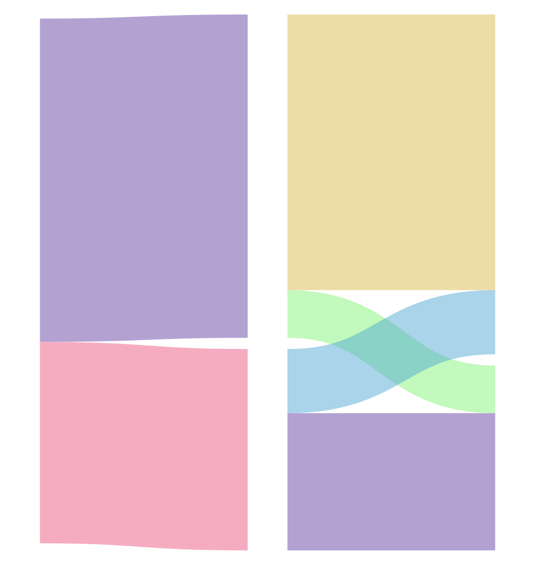

If you change the `stroke-width` to 6 you'll see the paths look like this. 

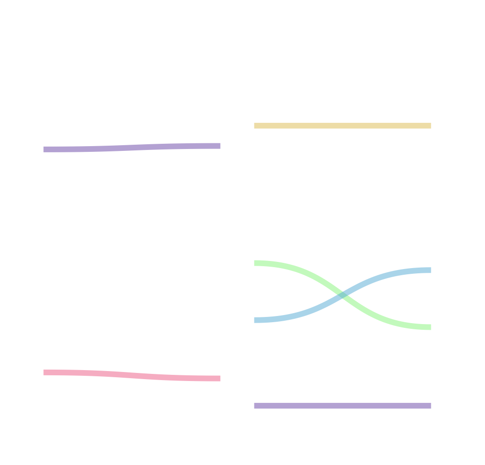

We can see that its the `stroke-width` that sets the width of the links, and the links are a single stroke rather than a shape with four sides. The generator has added a property that defines the `stroke-width`. 

```JS
.attr('stroke-width', d => d.width)
```

Using 6 for the width you'd get the picture above. 

```JS
.attr('stroke-width', 6)
```

The fill is set to none since the path is a single stroke. 

```JS
.attr('fill', 'none')
```

Set the shape of the link. 

```js
.attr('d', d3.sankeyLinkHorizontal())
```

Now add the nodes. These are the rectangles that connect the links together. 

Start by defining a group to hold the nodes. 

```js
const nodeGroup = svg
  .append("g")
```

Now create some rectangles to repesent the nodes. 

```js
nodeGroup
  .selectAll("rect")
  .data(nodes)
  .enter()
  .append('rect')
  .attr('class', 'node')
  .attr('height', d => d.y1 - d.y0)
  .attr('width', sankeyGen.nodeWidth())
  .attr('x', d => d.x0)
  .attr('y', d => d.y0)
  .attr('fill', 'black')
  .attr('opacity', 0.5)
```

Most of this is pretty straight forward. You are creating `rect` elements with a width, height, x, y, and fill color. 

Note! The sankey generator doesn't give us the height of the nodes. Instead it gives us y0 and y1. Where y0 is the location of the top and y1 is location of the bottom. To get the height you need to subtract y0 from y1. 

```js
.attr('height', d => d.y1 - d.y0)
```

To get the width of the node you can use `sankeyGen.nodeWidth()` which returns the value set with `.nodeWidth()` when you created the generator. 

Postion the `rect` using the `x0` and `y0` properties. 

```js
.attr('x', d => d.x0)
.attr('y', d => d.y0)
```

Now add the labels. 

```JS
svg
  .append('g')
  .selectAll('text')
  .data(nodes)
  .enter()
  .append('text')
  .text(d => d.name)
  .attr('text-anchor', 'middle')
  .attr('fill', 'black')
  .attr('font-size', '1rem')
  .attr('font-family', 'Helvetica')
  .attr('transform', d => `rotate(90, ${d.x0}, ${((d.y1 - d.y0) / 2) + d.y0})`)
  .attr('x', d => d.x0)
  .attr('y', d => ((d.y1 - d.y0) / 2) + d.y0 -13)
```

Most of this is straight forward. 

```js
.text(d => d.name)
.attr('text-anchor', 'middle')
.attr('fill', 'black')
.attr('font-size', '1rem')
.attr('font-family', 'Helvetica')
```

This sets the text, the fill color, text size, and font family. 

The `text-anchor` property sets the origin point of the text, `middle` places the origin in the center along the baseline of the text. 

There are a couple things that need to be looked at closely. 

```JS
.attr('transform', d => `rotate(90, ${d.x0}, ${((d.y1 - d.y0) / 2) + d.y0})`)
```

The line above rotates the text 90 degrees. The `rotate()` method takes three parameters: angle, x and y. The x and y values need to be set to the position of the text or the text rotates around the upper left corner of the svg element. 

```JS
.attr('x', d => d.x0)
.attr('y', d => ((d.y1 - d.y0) / 2) + d.y0 -13)
```

Last set the x and y using the properties provided by the sankey generator. Notice we are using the node data here and `x0` and `y0` represent the upper left corner of the node! 

When you're done the chart should look similar to this. 

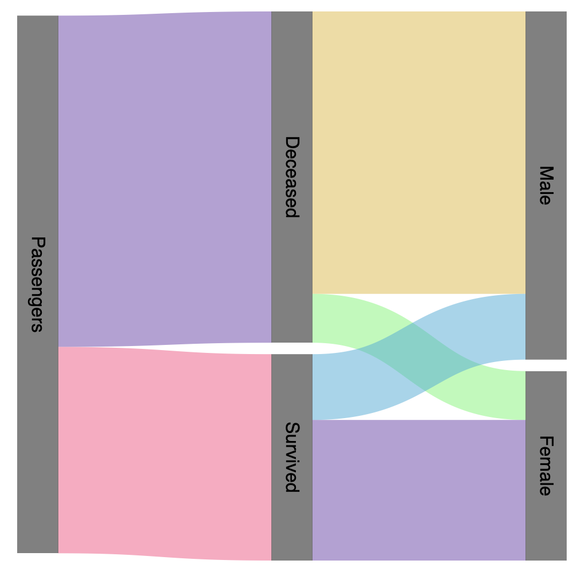

## Challenges! 
Try these challenges! 

**Challenge 1** Edit the source data. NOTE! If the sankey generator can't make sense of your data the whole chart will fail and disappear. Usually this happens when you create a link that links to a missing node or makes a connection that doesn't make sense. 

Try the examples from the beginning of this tutorial. 

**Challenge 2** Import the Titanic data and use it to create the data structure that we mocked up manually in this tutorial. You can use the functions you wrote to solve the Titanic data problems. 

**Challenge 3** Use a different dataset. You can use any dataset you like. 

For an easy problem try the cities data. Make the following nodes: 

- Total Population
- Population by country
- Population by city
